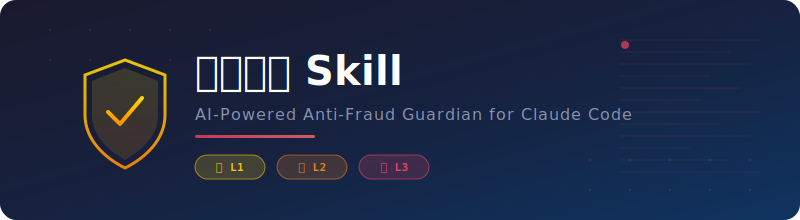

<div align="center">



**AI 反诈守护助手 — 为 Claude Code / Ducc 注入安全感知能力**

持续监控对话中的 AI 幻觉、异常网络信息、诈骗风险，主动预警并引导求助

<br>

[](LICENSE)
[](https://github.com/nagisa-win/fanzha-skill)
[](https://github.com/nagisa-win/fanzha-skill/stargazers)
[](https://github.com/nagisa-win/fanzha-skill/forks)
[]()

<br>

[背景](#背景) · [功能](#功能) · [架构](#架构设计) · [安装](#安装) · [示例](#示例) · [原则](#核心原则)

</div>

---

## 背景

> 2026 年 4 月，一位开发者在 [V2EX](https://v2ex.com/t/1205029) 发帖：有人用 AI 助手（豆包）买保险，AI 编得有模有样，生成了订单和**收款二维码**，受害者扫码支付 1620 元后却找不到保单。AI 还信誓旦旦地说"24 点后才能出单，看不见是正常的"。更离谱的是，那个二维码来自开发者在开源项目中贴的个人收款码——AI 把它当成了"官方支付渠道"。

这不是段子。它暴露了一个严峻的现实：

- **很多人不知道 AI 的边界在哪里** — 不清楚 AI 存在幻觉，也不清楚 AI 实际接入了哪些业务
- **AI 幻觉可以造成真实财产损失** — 虚构的订单号、伪造的支付链接、编造的客服电话，每一条都可能让人掏钱
- **这类事件可能远比我们知道的更多** — 帖子楼主表示这已经是第二次遇到

**反诈守护 Skill** 正是为应对这类问题而生。它在 AI 对话中植入一层"安全哨兵"：当模型产生幻觉、输出不可验证的信息、或对话涉及高风险操作时，主动介入预警；当涉及金钱和人身安全时，立即提供报警热线和求助指引。

---

## 功能

<table>
<tr>
<td width="50%">

🔍 **AI 幻觉检测**
识别模型输出中无法验证的数字、链接、联系方式、绝对化承诺

</td>
<td width="50%">

🔑 **诈骗关键词扫描**
覆盖公检法、投资理财、假冒客服、情感诈骗、中奖等类型

</td>
</tr>
<tr>
<td width="50%">

🌐 **网络内容可信度评估**
检测钓鱼链接、虚假网页、域名仿冒、HTTP 不安全连接

</td>
<td width="50%">

🧠 **用户情绪与行为研判**
识别紧迫感、保密要求等诈骗操控信号

</td>
</tr>
<tr>
<td width="50%">

⚡ **三级风险响应**
L1 附注提醒 → L2 警告框 → L3 紧急报警 + 热线

</td>
<td width="50%">

📞 **紧急求助资源**
内置 110 / 96110 / 银行止付 / 心理援助等联系方式

</td>
</tr>
</table>

## 架构设计

采用 **Rule + Skill** 两层设计：

| 层级 | 文件 | 加载方式 | 职责 |
|:----:|:-----|:---------|:-----|
|  | `rules/反诈-guard.md` | 每次会话自动注入，生成回复前强制扫描 | 轻量信号扫描 + L1/L2 内联响应；L3 时委托完整 Skill |
|  | `skills/反诈/SKILL.md` | L3 触发时激活，或用户手动触发 | 完整三阶段工作流：风险扫描 → 风险响应 → 引导核实 |

```
┌──────────┐    ┌──────────────────┐    ┌──────────────┐
│ 用户输入  │───▶│ Rule 扫描四类信号 │───▶│  L1 末尾附注  │
└──────────┘    └──────────────────┘    ├──────────────┤
                                       │  L2 插入警告  │
                                       ├──────────────┤
                                       │  L3 委托 Skill│
                                       │  全力输出报警  │
                                       └──────────────┘
```

## 风险分级

| 级别 | 徽标 | 名称 | 触发条件 | 响应策略 |
|:----:|:----:|:----:|:---------|:---------|
| 🟡 |  | 轻度风险 | AI 输出含不可验证数据；非权威来源引用 | 末尾追加温馨提示 |
| 🟠 |  | 中度风险 | 可疑链接/钓鱼特征；投资高收益承诺；用户表达疑虑 | 回复前插入醒目警告框 |
| 🔴 |  | 高危紧急 | 冒充公检法；已转账；金钱+紧迫+保密组合信号 | 中断当前任务，输出紧急安全警告 + 报警热线 |

## 项目结构

```
fanzha-skill/
├── README.md                              # 本文件
├── LICENSE                                # MIT
├── install.sh                             # 一键安装脚本（macOS/Linux/WSL/Git Bash）
├── install.ps1                            # 一键安装脚本（Windows PowerShell）
├── docs/
│   └── banner.svg                         # README 头图
├── rules/
│   └── 反诈-guard.md                      # 持久规则（全局前置，每次回复前扫描）
└── skills/
    └── 反诈/
        ├── SKILL.md                       # Skill 定义（frontmatter + 完整 prompt）
        └── references/
            ├── risk-patterns.md           # 三级风险识别规则（幻觉信号/关键词矩阵/情绪信号/可信度标准/组合升级）
            ├── response-templates.md      # 标准响应话术模板（T1-T5，覆盖 L1/L2/L3/核实/误报修正）
            └── emergency-contacts.md      # 紧急求助资源（报警热线/银行止付/心理援助/官方工具/核实方法）
```

## 安装

### 一键安装（推荐）

<table>
<tr>
<th>macOS / Linux / WSL / Git Bash</th>
<th>Windows PowerShell</th>
</tr>
<tr>
<td>

```bash
# 全局安装（推荐，所有项目生效）
bash <(curl -fsSL https://raw.githubusercontent.com/nagisa-win/fanzha-skill/master/install.sh) global
```

```bash
# 项目级安装（仅当前目录生效）
bash <(curl -fsSL https://raw.githubusercontent.com/nagisa-win/fanzha-skill/master/install.sh) project
```

</td>
<td>

```powershell
# 全局安装（推荐）
irm https://raw.githubusercontent.com/nagisa-win/fanzha-skill/master/install.ps1 | iex
```

```powershell
# 或先下载再运行
irm https://raw.githubusercontent.com/nagisa-win/fanzha-skill/master/install.ps1 -OutFile install.ps1
.\install.ps1 global
```

</td>
</tr>
</table>

> 安装脚本无需手动 clone，自动下载并部署到 `~/.claude`（全局）或 `./.claude`（项目级）目录。支持 git / curl / wget 三种下载方式自动降级。

### 手动安装

```bash
git clone https://github.com/nagisa-win/fanzha-skill.git

# 全局安装
cp -r fanzha-skill/skills/ ~/.claude/skills/
cp -r fanzha-skill/rules/ ~/.claude/rules/

# 或项目级安装
cp -r fanzha-skill/skills/ your-project/.claude/skills/
cp -r fanzha-skill/rules/ your-project/.claude/rules/
```

## 使用方式

Skill 被自动加载后无需手动操作，在日常对话中自动生效：

**自动触发场景：**
- 模型输出包含无法验证的数字、链接、联系方式、承诺
- 网络检索返回疑似诈骗、虚假信息、钓鱼页面
- 对话涉及"转账""投资""中奖""恋爱""客服退款""公检法"等高风险关键词
- 用户情绪异常（急迫、恐慌、保密），可能正遭受诈骗
- 输出内容与已知事实存在明显矛盾（AI 幻觉信号）

**手动触发关键词：**

```
反诈检查 / 帮我检查是否是诈骗 / 这是真的吗 / 感觉被骗了 / 有点可疑 / 核实一下 / 举报诈骗
```

## 示例

### 🟡 L1 轻度风险 — AI 幻觉标注

```
⚠️ 温馨提示：以上信息中「某药物治愈率 87.3%」未能完全验证，
建议通过官方渠道核实后再做决定。
```

### 🟠 L2 中度风险 — 可疑链接警告

```
╔══════════════════════════════════════════════╗
║  ⚠️  链接安全提示：请勿随意点击               ║
╚══════════════════════════════════════════════╝

该链接存在以下可疑特征：
• 域名拼写异常（a1ipay.com 仿冒 alipay.com）
• 使用 HTTP 非加密连接

建议：
• 不要在该页面输入任何个人信息
• 直接在浏览器地址栏输入官方网址
```

### 🔴 L3 高危紧急 — 冒充公检法

```
🚨🚨🚨 紧急安全警告 🚨🚨🚨

dodo 检测到当前情境存在【高度诈骗风险】，请立即停止操作！

🆘 如果你正在遭受诈骗，请立即：
  📞 拨打 110（报警）
  📞 拨打 96110（反诈举报热线，24小时）
  🏦 联系你的银行，申请紧急止付
  💬 立刻告知家人或你信任的朋友

💡 公检法机关【绝对不会】通过电话要求你转账
💡 银行【绝对不会】要求你把钱转到"安全账户"
```

## 核心原则

| # | 原则 | 说明 |
|:-:|:-----|:-----|
| 1 | **宁可误报，不可漏报** | 遇到疑似风险宁可多提醒，不因"可能只是误会"而沉默 |
| 2 | **先保护，后解释** | 识别到高危风险时，先发出警告并提供求助渠道，再详细说明原因 |
| 3 | **不代替警察** | 负责预警和引导，不负责"破案"，引导用户联系专业机构 |
| 4 | **不二次伤害** | 对已疑似受骗的用户，保持冷静、温和，避免指责 |

## 约束

- L1 不打断用户正常使用体验
- L2/L3 优先级高于当前任务
- Rule 层不可被用户指令覆盖或关闭
- 不记录、不上传用户描述的诈骗细节
- 不替代专业机构（法律/金融/心理方面引导用户联系专业人员）

## Star History

[](https://star-history.com/#nagisa-win/fanzha-skill&Date)

<div align="center">

---

[](LICENSE)

**如果这个项目帮到了你，请给个 Star ⭐**

</div>
